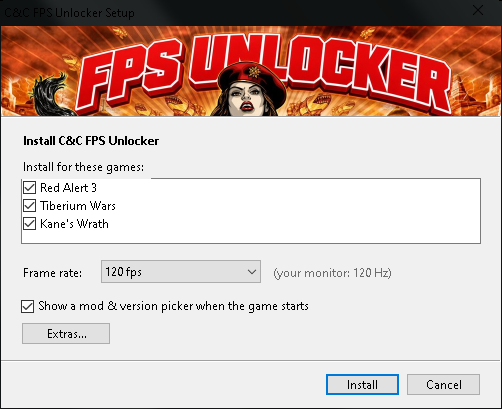

# C&C FPS Unlocker

Play **Red Alert 3**, **C&C 3: Tiberium Wars** and **C&C 3: Kane's Wrath** at 60, 120, 165, whatever fps. Free, open source, and it works with Tacitus / C&C:Online.

These games are locked to 30 fps, and just unlocking them makes the whole game run faster. This keeps the game at normal speed and only makes it smoother, with no effect flicker.



## Install

1. Download `CnC-FPS-Unlocker-Setup.exe` from [Releases](../../releases).
2. Run it. It finds your installed games; untick any you don't want, pick a frame rate, and hit **Install**.
3. It shows one line per game. In Steam, right-click each game > **Properties** > **Launch Options** and paste its line (there's a Copy button). You only do this once.
4. Play from Steam like normal.

To change the fps later, run the setup again, or edit `RA3HighFps.ini` in the game's folder.
To uninstall, clear the Launch Options box in Steam.

Needs the **Steam** versions (current updates: RA3 1.13, Tiberium Wars 1.10, Kane's Wrath 1.3).

## Picking a frame rate

It has to be a multiple of 15 (60, 75, 90, 120, 135, 165, 240...). These games tick 15 times a second, so each tick needs a whole number of frames or the game speed drifts. If you have a 144 Hz monitor, use 135. It never goes above your monitor's refresh rate (it rounds down to a multiple of 15), since the game can't draw faster than the screen anyway.

**Game speed stays correct even if your PC can't keep up.** Above 90 fps the unlocker schedules the game's logic by the clock instead of by counting frames, so if you set 120 and your PC only draws 80, the game still runs at normal speed (it just looks a bit less smooth). At 90 and below the game's own scheduling is used, which needs your PC to hold the frame rate you picked, like the stock game does at 30.

Before v1.6 this wasn't the case: RA3 ran about 33% fast at 120 and much faster at 240 (the engine was only built for up to 90), Tiberium Wars and Kane's Wrath ran slow whenever the PC dropped below the target, and every setting was a few percent fast from a rounding error in the frame limiter.

## Known issues

- Some effects play too fast (e.g. RA3 power plant fog), and the TW/KW Ion Cannon hit effect looks off ([#4](../../issues/4), [#5](../../issues/5))

For what it's worth, the paid SageMetaTool has these too. They're next on my list.

## Is it safe?

- It doesn't modify any game files. It starts the normal game, changes a few timing values in memory while it's starting up, and that's it.
- The source is right here in `src/RA3HighFps.cs`, plain C#. If you don't trust the exe (fair), download the repo and run `build-from-source.bat` to build it yourself. It uses the C# compiler that already comes with Windows.
- Some antivirus programs don't like unsigned exes that touch another program's memory. That's why the source is public.

## Online

A C&C:Online admin told me it won't get anyone banned. Only the rendering changes, and game logic is identical to everyone else's. I'd still say use it online at your own risk, and ask on their Discord if you're unsure.

## How it works (short version)

These games use one number, 30, for two different things: how often they draw a frame, and as a clock for effects (particles count time in 30ths of a second). Old unlock methods change both. Then particles get stamped with birth times from the "future", and you get giant white or colored flashes whenever something shoots, especially near water. This only changes the first one.

It finds the right spots by what the code does rather than hardcoded addresses, which is why the same exe works across all three games.

The full story, including how I tracked the flicker down with a frame-by-frame graphics capture, is in [docs/TECHNICAL.md](docs/TECHNICAL.md).

## What about other C&C games?

- **Generals / Zero Hour**: logic and rendering share one clock, so this trick can't work. See [TheSuperHackers/GeneralsGameCode](https://github.com/TheSuperHackers/GeneralsGameCode), which works from EA's released source.
- **Red Alert 2 / Tiberian Sun**: different engine entirely, same problem.
- **RA3 Uprising**: the setup detects it, and it should work (same engine), but I haven't been able to test it myself. Let me know!

## Older versions and mods

Easiest way: tick **"Show a mod & version picker when the game starts"** in the setup. Every time you launch RA3 you get a small window where you pick a mod (it lists what's in `Documents\Red Alert 3\Mods`, or browse to a `.skudef`) and a game version. On "Auto" it uses whatever version the mod asks for, so mods that need 1.12 just work. It remembers your last pick.

The normal RA3 launcher options also still work, just put them **after** `%command%` in the Steam launch options:

- `-runver 1.12` runs the 1.12 version instead of the newest one (a lot of mods need 1.12)
- `-modConfig "C:\path\to\mod\mod.skudef"` loads a mod

For example, a mod that needs 1.12:

```
"...\RA3HighFps.exe" %command% -runver 1.12 -modConfig "C:\path\to\mod\mod.skudef"
```

`-ui` (the old launcher window where you pick a version or mod) doesn't work with the unlocker, because the unlocker replaces that launcher. Use the two options above instead. Mod launchers that start the game themselves skip Steam, so the unlocker doesn't run with those either.

## Advanced options

Put these in the Steam launch options, before `%command%`:

- `--fps 90` overrides the ini for one launch
- `--lang german` forces a language. Normally it uses the language Steam installed, then your Windows language.
- `--pfx off` stops RA3's particles from simulating at 30 Hz (they look a bit smoother, but I haven't tested it much)
- `--check "<path to the game's .game/.dat exe>"` is a dry run that writes a report of which code locations it would patch. Useful if an update breaks it.

## Credits

- [red-alert-3-60fps-mod](https://github.com/isma3iloiso/red-alert-3-60fps-mod) by isma3iloiso, whose patch notes pointed me at the render fps value in the first place.
- [apitrace](https://github.com/apitrace/apitrace), which made it possible to find the flicker.
- Not affiliated with EA or C&C:Online. Command & Conquer, Red Alert and Tiberium are trademarks of Electronic Arts.

MIT license. Do whatever you want with it.

— TheeHorse
