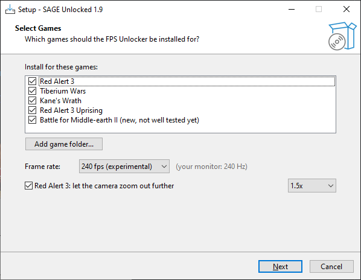

# SAGE Unlocked

*Formerly C&C FPS Unlocker.*

Play **Red Alert 3**, **Uprising**, **C&C 3: Tiberium Wars**, **Kane's Wrath**, **Battle for Middle-earth II** and **Rise of the Witch-king** at 60, 120, 165 or whatever your monitor does. Works on Windows and Linux. Free and open source.

These games are locked to 30 fps and if you just unlock them the whole game speeds up. This keeps the game speed normal and only makes it smoother. No effect flicker either.

## Install

Either way there's no launch option to set, you just play the game like normal (Steam, EA app, disc, whatever).

**With the setup:** grab `SAGE-Unlocked-Setup.exe` from [Releases](../../releases) and run it. It finds your games, pick a frame rate and hit **Next**. If it doesn't find a game (EA app, Origin, disc in a weird spot) use **Add game folder...** and pick the game's install folder.

**By hand, no exe at all:** grab `SAGE-Unlocked.zip` from [Releases](../../releases) and copy the three files for your game next to the game's actual exe:

| Game | Files | Put them in |
|---|---|---|
| Red Alert 3 (1.12 / 1.13) | `d3d9.dll`, `CnCFpsUnlocker.dll`, `SAGEUnlocked.ini` | `<RA3>\Data\` |
| Red Alert 3 Uprising | `d3d9.dll`, `CnCFpsUnlocker.dll`, `SAGEUnlocked.ini` | `<Uprising>\Data\` |
| Tiberium Wars (1.10) | `dinput8.dll`, `CnCFpsUnlocker.dll`, `SAGEUnlocked.ini` | `<TW>\RetailExe\1.10\` |
| Tiberium Wars (1.9, some mods use it) | `dinput8.dll`, `CnCFpsUnlocker.dll`, `SAGEUnlocked.ini` | `<TW>\RetailExe\1.9\` |
| Kane's Wrath (1.3) | `dinput8.dll`, `CnCFpsUnlocker.dll`, `SAGEUnlocked.ini` | `<KW>\RetailExe\1.3\` |
| Kane's Wrath (1.02: mods, EA app / Origin / disc) | `dinput8.dll`, `CnCFpsUnlocker.dll`, `SAGEUnlocked.ini` | `<KW>\RetailExe\1.2\` |
| Battle for Middle-earth II (1.06) | `dinput8.dll`, `CnCFpsUnlocker.dll`, `SAGEUnlocked.ini` | `<BFME2>\` (next to `game.dat`) |
| Rise of the Witch-king (2.02) | same 3 files (from the BFME2 folder in the zip) | `<RotWK>\` (next to `game.dat`) |

**Linux (Steam Proton / Wine):** same files, same folders as the table above. No launch option and no protontricks / dotnet48, Proton's own wine-mono is enough. If you set a launch option for an older version, clear it. Tested through Steam with Proton Experimental and Proton-CachyOS ([#16](../../issues/16)).

To change the fps run the setup again or edit `SAGEUnlocked.ini` (the zip has ready-made ones for each fps in `FPS presets`). To uninstall delete `d3d9.dll` / `dinput8.dll`.

**Updating?** Just install over the old version. Up to 1.9.4 the ini was called `RA3HighFps.ini`, the setup renames it for you and an old one still works if it's the only one there. Coming from v1.6 or older, clear the Steam launch option (right-click the game > Properties > Launch Options) or delete the old `RA3HighFps.exe`, otherwise the old version patches first and the new fixes don't run. The setup handles the exe for you.

## What it fixes

Unlocking the frame rate is the easy part. Lots of things in these games count drawn frames instead of time, so at 120 fps they'd run 4x fast or look choppy. These are fixed:

- **Game speed:** game logic runs off the real clock, so the game stays at normal speed even when your PC can't hold the fps
- **Smooth movement:** units, turrets turning, knocked over lamp posts falling
- **Camera:** scrolling, numpad zoom and rotate, screen shake
- **Effects:** particles, tracers, lasers, fades, blinking markers, unit flashes, all at normal speed and without the white flicker
- **RA3 construction:** Soviet and Empire buildings build up at the right speed instead of popping up instantly
- **Timers:** double tap to jump to a group, radar and marker timers
- **TW / KW:** flamethrower crash, money tick sound, credit popups
- **Replays:** fast forward works

Every fix shows up by name in `SAGEUnlocked.log`. If one causes trouble you can turn it off on its own with `skip=` in the ini (e.g. `skip=turrets`).

## Picking a frame rate

Has to be a multiple of 15 (60, 75, 90, 120, 135, 165, 240...). The game ticks 15 times a second so every tick needs a whole number of frames or the speed drifts. 144hz monitor? Use 135. It won't go above your monitor's refresh rate anyway since the game can't draw faster than your screen.

If you set 120 and only get 80 the game still runs at normal speed, it just looks a bit less smooth.

## Known issues

- **240 fps is experimental**, some people have had problems with it. If you're on a 240hz monitor and something's weird try 165 or 120
- **The Soviet reactor flickers** in RA3. Looking into it
- **BFME2 / RotWK** are newer and less tested than the C&C games. If something looks too fast, choppy or broken, open an issue with your `SAGEUnlocked.log` (it's in the game folder)
- **BFME All In One Launcher / Competitive Arena** delete files they don't know from the game folder, so the mod's 3 files disappear after you play. Start the game with `lotrbfme2.exe` / `lotrbfme2ep1.exe` instead, or copy the files back each time
- The RA3 power plant fog and the TW/KW Ion Cannon should be fixed but need confirming ([#4](../../issues/4), [#5](../../issues/5))

## Something not working?

Tested on the **Steam** versions (RA3 1.13, Uprising, Tiberium Wars 1.10, Kane's Wrath 1.3) on Windows and Linux. If it doesn't work on your copy or the game crashes, open an issue with your `SAGEUnlocked.log` (and `RA3HighFps.log` if there is one, the small dll writes crashes there). They're next to the game's exe (same folder as the dlls), or in `%TEMP%` if the game folder is read-only. The log says which fixes loaded and, if the game crashed, where, which helps me a lot.

## Extras

Stuff that isn't about frame rate. Off unless you turn it on in the setup (or the ini).

- **Camera zoom-out (RA3):** lets you zoom out further (1.25x or 1.5x). Only in skirmish and campaign, online and LAN always use normal zoom so nobody gets an advantage. Further out, the game stops drawing the ground (and water) at the top of the screen on maps with big height differences, so 1.5x is the max.

## Is it safe?

- It doesn't touch any game files. The game loads the dll from its own folder like any other dll mod, the dll changes some timing code in the game's memory while it's starting, and that's it. No network code, nothing runs outside the game
- The setup is optional and only copies files. If you don't want to run an exe, install by hand
- Everything's built from the source here: [`src/Unlocker.cs`](src/Unlocker.cs) (the fixes, C#), [`installer/setup.iss`](installer/setup.iss) (the setup, made with [Inno Setup](https://jrsoftware.org/isinfo.php)) and [`dll/proxy.c`](dll/proxy.c) (the small `d3d9.dll` / `dinput8.dll`). Run `build-from-source.bat` to build the dll yourself with the C# compiler that comes with Windows, and `dll/build.bat` for the small dlls (needs MinGW)

## How it works (short version)

These games use the number 30 for two different things: how often they draw a frame, and as a clock for effects (particles count time in 30ths of a second). Old unlock methods change both, so particles get birth times from the "future" and you get huge white or colored flashes whenever something shoots, especially near water. This only changes the first one, then goes through everything else that counted drawn frames and puts it back on a 30 Hz or real-time clock.

It finds what to patch by what the code does instead of hardcoded addresses, which is why the same dll works for all these games and versions.

The full story, including how I tracked down the flicker with a frame by frame graphics capture, is in [docs/TECHNICAL.md](docs/TECHNICAL.md).

## What about other C&C games?

- **Generals / Zero Hour**: logic and rendering use the same clock so this trick doesn't work. Check out [TheSuperHackers/GeneralsGameCode](https://github.com/TheSuperHackers/GeneralsGameCode), they work from EA's released source
- **Red Alert 2 / Tiberian Sun**: totally different engine, same problem
- **BFME1**: not yet. It runs on the older Generals engine where the game logic is tied to the frame rate, so it needs a different approach than BFME2 and RotWK

## Older versions and mods

Since the game loads the dll itself, mods and older versions just work the normal way: `-ui` (the RA3 launcher window), `-runver 1.12`, `-modConfig "...\mod.skudef"` and mod launchers like GenEvo's all still get the fps fix. RA3 1.12 and 1.13 both live in `Data\`, so one install covers both.

## Credits

- [red-alert-3-60fps-mod](https://github.com/isma3iloiso/red-alert-3-60fps-mod) by isma3iloiso, their patch notes pointed me at the render fps value in the first place
- [CNCStuff/cnc3_fps_patch](https://github.com/CNCStuff/cnc3_fps_patch), which found many of the C&C3 fixes (frame limiter, scroll, numpad camera, effects, anim timing)
- [apitrace](https://github.com/apitrace/apitrace), couldn't have found the flicker without it
- Not affiliated with EA. Command & Conquer, Red Alert and Tiberium are trademarks of Electronic Arts

GPL v3 (see LICENSE). Use it, share it, change it, but anything built from this code has to stay open source under the same license and keep the credit. Versions up to v1.5 were MIT.

If this made your game better and you want to say thanks, you can [buy me a coffee](https://buymeacoffee.com/sageeunloc0).

- TheeHorse
